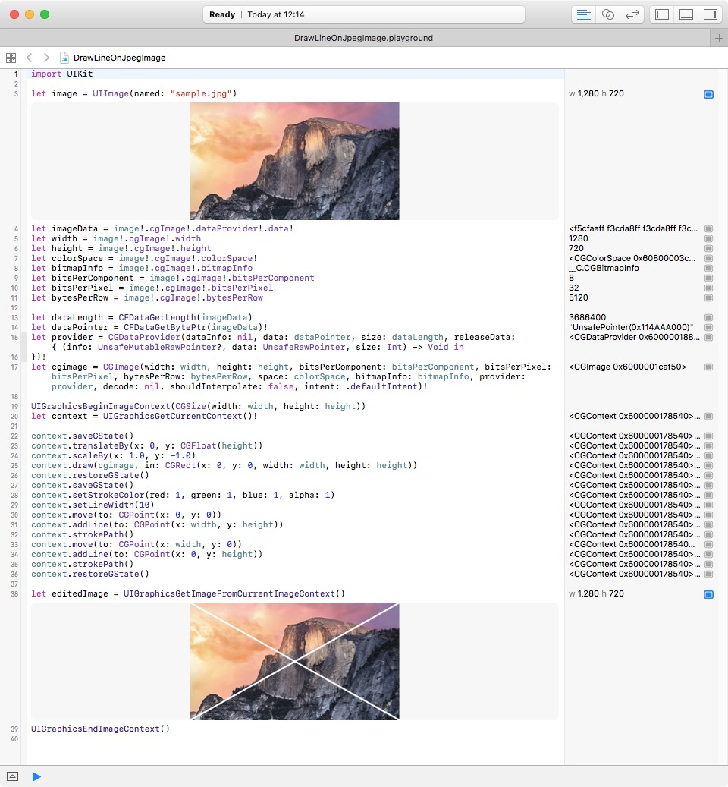

# DrawLineOnJpegImage

このPlaygroundは、JPEG画像を読み込んでCore Graphicsで落書きする、Swiftで書かれたサンプルです。

## 動作環境

* Mac OS X Sierra
* Xcode 8.3.3
* Playground

## ライセンス

* [MITライセンス](http://opensource.org/licenses/mit-license.php)

